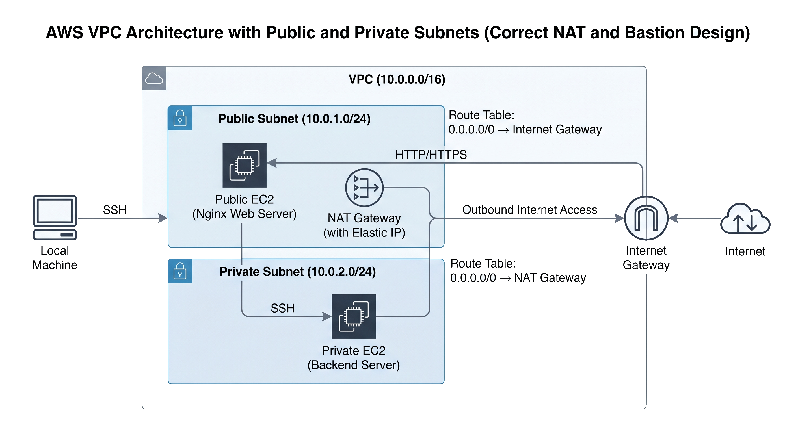

# 🚀 AWS VPC Architecture & Troubleshooting Lab

## 📌 Overview

This project demonstrates the design, deployment, and troubleshooting of a custom AWS VPC environment with public and private subnets.

Instead of only building infrastructure, I simulated real-world failures and debugged them step-by-step to develop practical cloud support skills.

---

## 🏗️ Architecture

### Components:

* VPC (10.0.0.0/16)
* Public Subnet (10.0.1.0/24)
* Private Subnet (10.0.2.0/24)
* Internet Gateway (IGW)
* NAT Gateway
* Route Tables (Public & Private)
* EC2 Instances:

  * Public EC2 (Nginx Web Server)
  * Private EC2 (Backend Server)

---

## 🔧 Phase 1: Infrastructure Setup

### Steps:

* Created VPC and subnets
* Attached Internet Gateway
* Configured route tables
* Launched EC2 instances
* Installed Nginx on public EC2
* Verified website access

📸 Screenshots:

* 01–08 (Setup & working state)

---

## 🔥 Phase 2: Troubleshooting Scenarios

---

### ❌ Issue 1: Website Down (Security Group Misconfiguration)

**Problem:**
HTTP access blocked

**Diagnosis:**

* EC2 running
* Nginx active
* Network correct

**Root Cause:**
Security Group missing HTTP (port 80)

**Fix:**
Added inbound HTTP rule

**Result:**
Website restored

📸 Screenshots:

* 09–13

---

### ❌ Issue 2: Private EC2 No Internet Access

**Problem:**
Private instance unable to access internet

**Diagnosis:**

* SSH working
* No outbound connectivity

**Root Cause:**
Missing NAT Gateway route

**Fix:**

* Created NAT Gateway in public subnet
* Updated private route table

**Result:**
Outbound internet restored

📸 Screenshots:

* 14–18

---

### ❌ Issue 3: SSH Failure to Private EC2

**Problem:**
Unable to SSH into private instance

**Root Cause:**
Security Group blocked SSH from bastion

**Fix:**
Allowed SSH from Public EC2 Security Group

**Result:**
SSH restored

📸 Screenshots:

* 19–22

---

### ❌ Issue 4: Website Down (Routing Issue)

**Problem:**
Website inaccessible despite running services

**Root Cause:**
Route table missing Internet Gateway route

**Fix:**
Restored correct routing

**Result:**
Website accessible again

📸 Screenshots:

* 23–26

---

## 🧠 Key Learnings

* Subnet behavior depends on route tables, not names
* Internet Gateway requires public IP for inbound access
* NAT Gateway enables outbound internet for private subnets
* Security Groups control both internal and external traffic
* Systematic troubleshooting is critical in cloud environments

---

## 🛠️ Skills Demonstrated

* AWS VPC Design
* EC2 Deployment & Configuration
* Networking (IGW, NAT, Routing)
* Security Groups & Access Control
* Real-world Troubleshooting

---

## 🎯 Conclusion

This project strengthened my ability to not only build cloud infrastructure but also diagnose and fix real-world issues — a key requirement for Cloud Support and DevOps roles.
